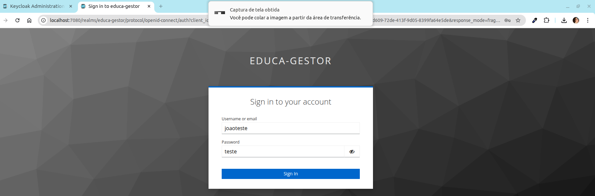

# educa-gestor

Desenvolver uma aplicação web responsiva para administrar alunos, professores e cursos com integração ao keycloak.

## Tecnologias utilizadas
- backend: Java 21 com Quarkus
- frontend: Angular 20 (standalone)

## Autores

- [@thais-amorim](https://github.com/thais-amorim)


## Demonstração

Insira um gif ou um link de alguma demonstração

## Como executar o projeto
 Pré-requisitos:
 - Ter o java 21 instalado
 - Ter docker e docker-compose instalados

```bash
# Executar o docker-compose para subir:
# - o banco de dados postgres
# - o keycloak
$ cd educa-gestor/dockerfiles
$ docker-compose -f docker-compose.yml up


# Executar o backend
$ cd educa-gestor/backend
$ quarkus dev

#Executar o frontend
$ cd educa-gestor/frontend
$ ng serve
```

## Funcionalidades

### Frontend
  - Angular Material UI
  - Fazer login com usuário criado manualmente no keycloak
  - Realizar processo de primeiro login e atualizar dados do user no keycloak

  

  

  

### Backend
  - Criado com java e quarkus
  - Foi utilizado DDD para organizar o código
  - Solicita a autenticação para acessar os endpoints com `@Authenticated`, onde basta ser um usuário com token criado pelo keycloak. Não foi implementado a distinção pela role (e.g. admin, coordenador).
  - A estrutura do banco de dados Postgres foi criadao usando migrations, ver `backend/src/main/resources/db/migration`. Ao subir o service flyway do docker-compose, ele já faz a aplicação dessas migrations.
  - Incluir, excluir, atualizar e visualizar:
    - disciplina (`subject`)
    - semestre (`semester`)
    - curso (`course`)

